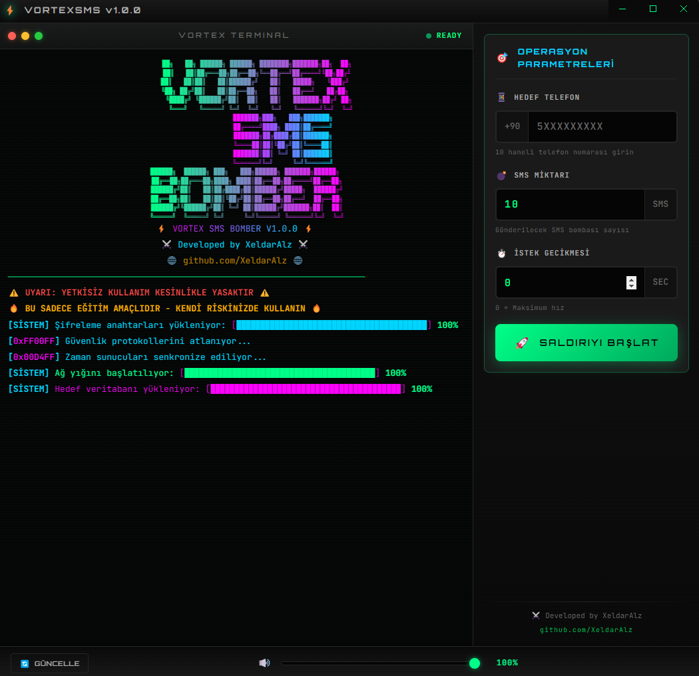

# VortexSMS

[](https://github.com/XeldarAlz/Vortex-SMS-Bomber/releases)
[](LICENSE)
[](https://nodejs.org/)
[]()
[](https://github.com/sponsors/XeldarAlz)

> **Dil**: [English](README_EN.md) | [Türkçe](README.md)

```
██╗   ██╗ ██████╗ ██████╗ ████████╗███████╗██╗  ██╗    ███████╗███╗   ███╗███████╗
██║   ██║██╔═══██╗██╔══██╗╚══██╔══╝██╔════╝╚██╗██╔╝    ██╔════╝████╗ ████║██╔════╝
██║   ██║██║   ██║██████╔╝   ██║   █████╗   ╚███╔╝     ███████╗██╔████╔██║███████╗
╚██╗ ██╔╝██║   ██║██╔══██╗   ██║   ██╔══╝   ██╔██╗     ╚════██║██║╚██╔╝██║╚════██║
 ╚████╔╝ ╚██████╔╝██║  ██║   ██║   ███████╗██╔╝ ██╗    ███████║██║ ╚═╝ ██║███████║
  ╚═══╝   ╚═════╝ ╚═╝  ╚═╝   ╚═╝   ╚══════╝╚═╝  ╚═╝    ╚══════╝╚═╝     ╚═╝╚══════╝
```

## VortexSMS Nedir?

VortexSMS birçok farklı servis üzerinden aynı anda SMS mesajları gönderen bir araçtır. SMS sistemlerini test etmek veya öğrenme amaçlı kullanabilirsiniz.

## Özellikler

- Türkçe ve İngilizce dil desteği
- Modern arayüzlü Windows masaüstü uygulaması
- 50'den fazla SMS servisi desteği
- Mesajlar arası ayarlanabilir gecikme
- Gerçek zamanlı ilerleme ve istatistikler
- GitHub releases üzerinden otomatik güncelleme
- Güzel terminal tarzı arayüz
- Ses efektleri ve arka plan müziği

## Ekran Görüntüleri

<div align="center">
  
</div>

## Kurulum

### Windows Masaüstü Uygulaması (Önerilen)

En son sürümü [Releases](https://github.com/XeldarAlz/Vortex-SMS-Bomber/releases) sayfasından indirin:

| Dosya | Açıklama |
|-------|----------|
| `VortexSMS-Setup-x.x.x.exe` | Kurulum dosyası (önerilen) |
| `VortexSMS-Portable-x.x.x.exe` | Taşınabilir sürüm (kurulum gerektirmez) |

Uygulama **otomatik güncelleme** özelliğine sahiptir - yeni sürüm çıktığında bildirim alırsınız.

### Terminal Versiyonu (Windows/Mac/Linux)

Komut satırı kullanımı veya geliştirme için:

**Gereksinimler**: Node.js 12.0 veya üzeri

```bash
# Repoyu klonlayın
git clone https://github.com/XeldarAlz/Vortex-SMS-Bomber.git
cd Vortex-SMS-Bomber

# Bağımlılıkları yükleyin
npm install

# Terminal versiyonunu çalıştırın
npm start
```

## Katkıda Bulunma

Katkılarınızı bekliyorum. Detaylı kılavuz için [CONTRIBUTE_TR.md](CONTRIBUTE_TR.md) dosyasına bakın.

## Yasal Uyarı

**UYARI: Bu araç yalnızca eğitim amaçlıdır.**

- Yerel yasa ve düzenlemelere uyun
- Herhangi bir sistemi test etmeden önce izin alın
- Başkalarını rahatsız etmek veya zarar vermek için kullanmayın
- Yetkisiz kullanım yasal sonuçlar doğurabilir

Geliştiriciler bu yazılımın herhangi bir kötüye kullanımından sorumlu değildir.

## Lisans

Bu proje **GNU Affero Genel Kamu Lisansı v3.0 (AGPL-3.0)** altındadır. Bu lisans, kodu değiştiren veya kullanan herkesin kaynak kodunu paylaşmasını zorunlu kılar - web servisleri dahil. Detaylar için [LICENSE](LICENSE) dosyasına bakın.

## Destek

- **Hata bildirimleri**: [Issue açın](https://github.com/XeldarAlz/Vortex-SMS-Bomber/issues)
- **Sorular**: [GitHub Discussions](https://github.com/XeldarAlz/Vortex-SMS-Bomber/discussions)
- **Projeyi beğendiniz mi?** Yıldız verin!

## Sponsorlar

VortexSMS'in geliştirilmesini destekleyin:

[](https://github.com/sponsors/XeldarAlz)
