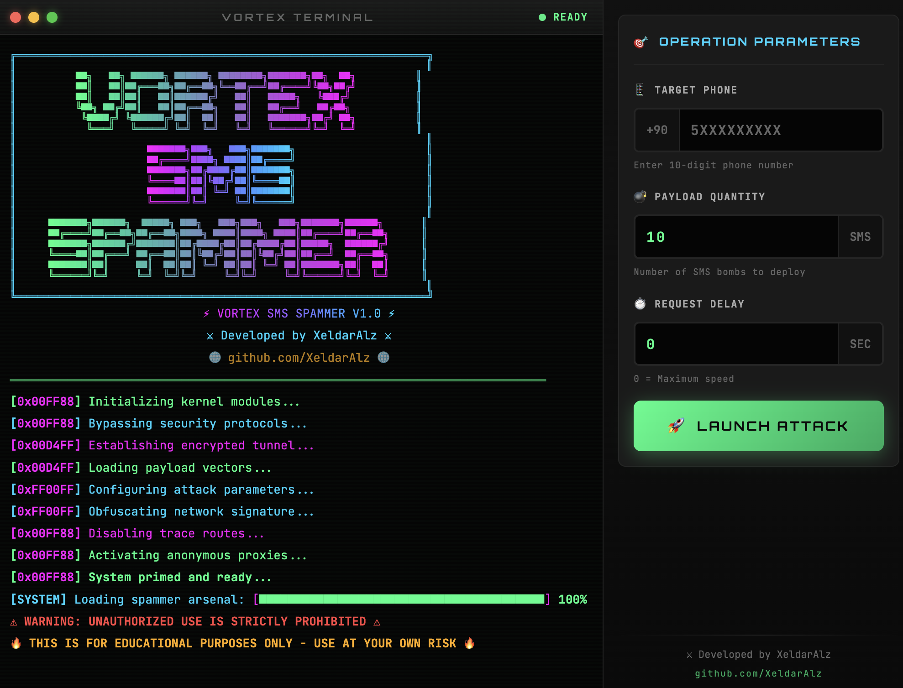

# VortexSMS

[](https://github.com/XeldarAlz/Vortex-SMS-Bomber/releases)
[](LICENSE)
[](https://nodejs.org/)
[]()
[](https://github.com/sponsors/XeldarAlz)

> **Dil**: [English](README.md) | [Türkçe](README_TR.md)

```
██╗   ██╗ ██████╗ ██████╗ ████████╗███████╗██╗  ██╗    ███████╗███╗   ███╗███████╗
██║   ██║██╔═══██╗██╔══██╗╚══██╔══╝██╔════╝╚██╗██╔╝    ██╔════╝████╗ ████║██╔════╝
██║   ██║██║   ██║██████╔╝   ██║   █████╗   ╚███╔╝     ███████╗██╔████╔██║███████╗
╚██╗ ██╔╝██║   ██║██╔══██╗   ██║   ██╔══╝   ██╔██╗     ╚════██║██║╚██╔╝██║╚════██║
 ╚████╔╝ ╚██████╔╝██║  ██║   ██║   ███████╗██╔╝ ██╗    ███████║██║ ╚═╝ ██║███████║
  ╚═══╝   ╚═════╝ ╚═╝  ╚═╝   ╚═╝   ╚══════╝╚═╝  ╚═╝    ╚══════╝╚═╝     ╚═╝╚══════╝
```

## VortexSMS Nedir?

VortexSMS bircok farkli servis uzerinden ayni anda SMS mesajlari gonderen bir aractir. SMS sistemlerini test etmek veya ogrenme amacli kullanabilirsiniz.

## Ozellikler

- Turkce ve Ingilizce dil destegi
- Modern arayuzlu Windows masaustu uygulamasi
- 50'den fazla SMS servisi destegi
- Mesajlar arasi ayarlanabilir gecikme
- Gercek zamanli ilerleme ve istatistikler
- GitHub releases uzerinden otomatik guncelleme
- Guzel terminal tarzi arayuz
- Ses efektleri ve arka plan muzigi

## Ekran Goruntuleri

<div align="center">
  
</div>

## Kurulum

### Windows Masaustu Uygulamasi (Onerilen)

En son surumu [Releases](https://github.com/XeldarAlz/Vortex-SMS-Bomber/releases) sayfasindan indirin:

| Dosya | Aciklama |
|-------|----------|
| `VortexSMS-Setup-x.x.x.exe` | Kurulum dosyasi (onerilen) |
| `VortexSMS-Portable-x.x.x.exe` | Tasinabilir surum (kurulum gerektirmez) |

Uygulama **otomatik guncelleme** ozelligine sahiptir - yeni surum ciktiginda bildirim alirsiniz.

### Terminal Versiyonu (Windows/Mac/Linux)

Komut satiri kullanimi veya gelistirme icin:

**Gereksinimler**: Node.js 12.0 veya uzeri

```bash
# Repoyu klonlayin
git clone https://github.com/XeldarAlz/Vortex-SMS-Bomber.git
cd Vortex-SMS-Bomber

# Bagimliliklari yukleyin
npm install

# Terminal versiyonunu calistirin
npm start
```

## Katkida Bulunma

Katkilarinizi bekliyoruz! Detayli kilavuz icin [CONTRIBUTE_TR.md](CONTRIBUTE_TR.md) dosyasina bakin.

## Yasal Uyari

**UYARI: Bu arac yalnizca egitim amaclidir.**

- Yerel yasa ve duzenlemelere uyun
- Herhangi bir sistemi test etmeden once izin alin
- Baskalarini rahatsiz etmek veya zarar vermek icin kullanmayin
- Yetkisiz kullanim yasal sonuclar dogurabilir

Gelistiriciler bu yazilimin herhangi bir kotuye kullanimindan sorumlu degildir.

## Lisans

Bu proje **Ticari Olmayan Lisans** altindadir. Ticari kullanim yasaktir. Detaylar icin [LICENSE](LICENSE) dosyasina bakin.

## Destek

- **Hata bildirimleri**: [Issue acin](https://github.com/XeldarAlz/Vortex-SMS-Bomber/issues)
- **Sorular**: [GitHub Discussions](https://github.com/XeldarAlz/Vortex-SMS-Bomber/discussions)
- **Projeyi begendiziniz mi?** Yildiz verin!

## Sponsorlar

VortexSMS'in gelistirilmesini destekleyin:

[](https://github.com/sponsors/XeldarAlz)
